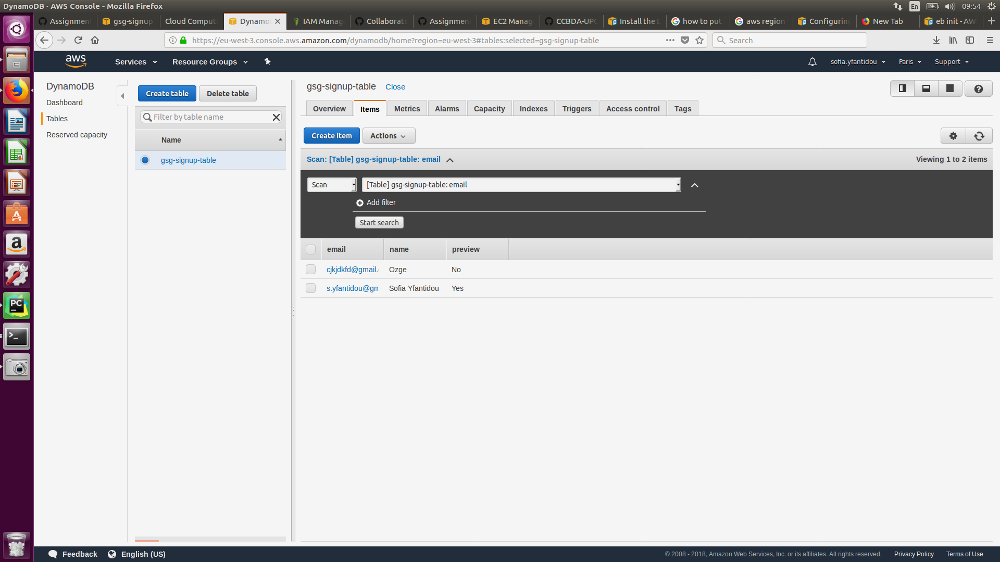
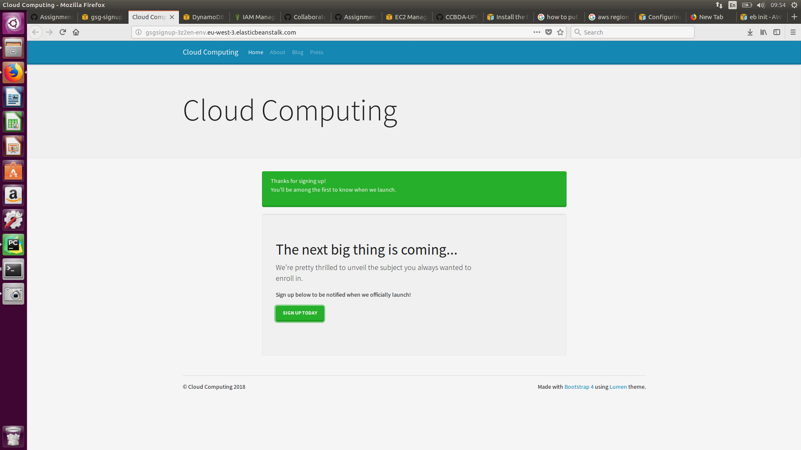

## Task 4.5: Create the AWS Beanstalk environment and deploy the sample web app

### DynamoDB
The following screenshot captures a sample of our data in DynamoDB. First one is the local test and the second one is after the deployment.

### Deployed Application
The following screenshot captures the deployed application.

### Our answers
When we **terminated the EC2 instance**, the EBS recognised it as a "health" issue/risk (missing instance). However, 
it immediately ran a second instance to restore "health" and keep the web app running.
On the contrary, when we **terminated the environment from the EBS console**, the instance was terminated as well.
This is logical since that the sole purpose of the instance was to serve the deployed app.

### Additional Information
We worked on this session for approximately 3 hours in total. 

Our main problems were connectivity issue with the AWS EC2 instance probably because of connectivity and IP configurations.
Moreover, we had to change the software configuration manually for our deployed web app to launch because the tags, which 
specified during the set-up did not work (See below).

AWS_REGION = eu-west-3  
DEBUG = False  
STARTUP_SIGNUP_TABLE = gsg-signup-table  

Both of the team members are using Ubuntu 16.04.

### Application Code
You can find the initial application code in our [Github Repo](https://github.com/syfantid/eb-django-express-signup).
