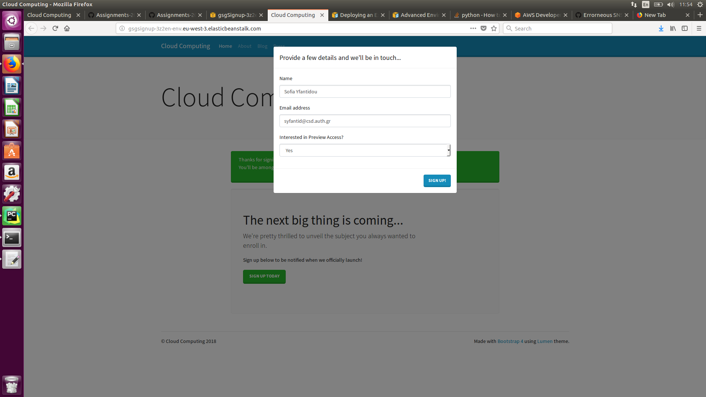
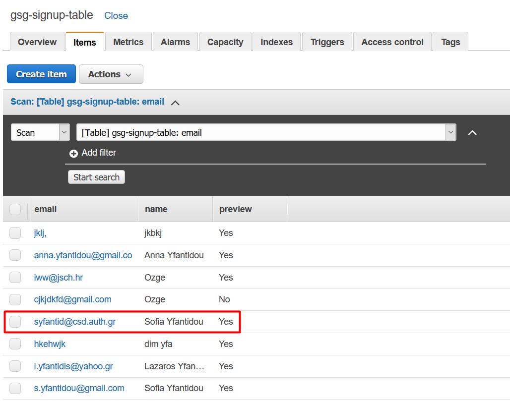
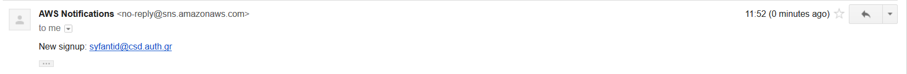
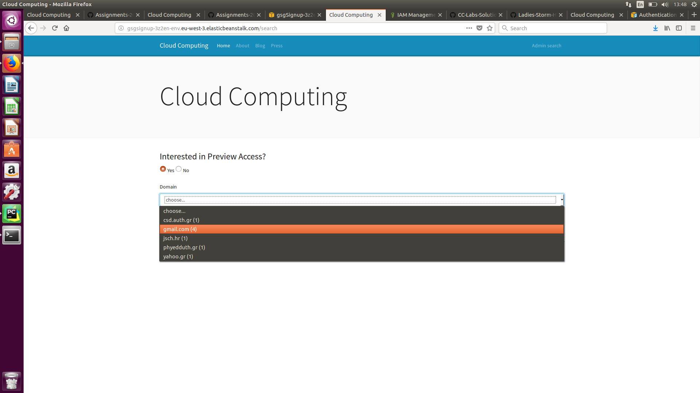
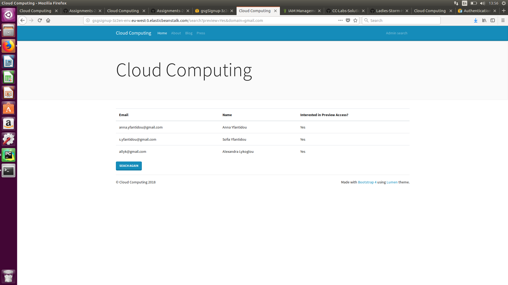
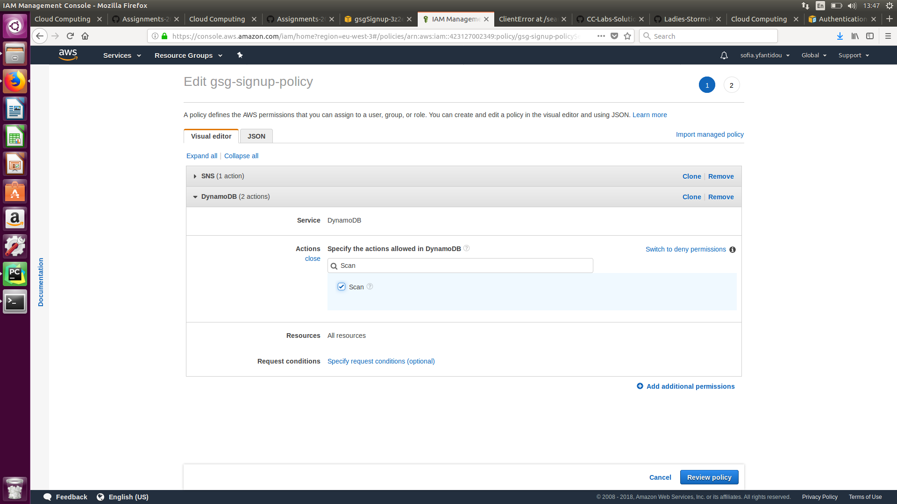
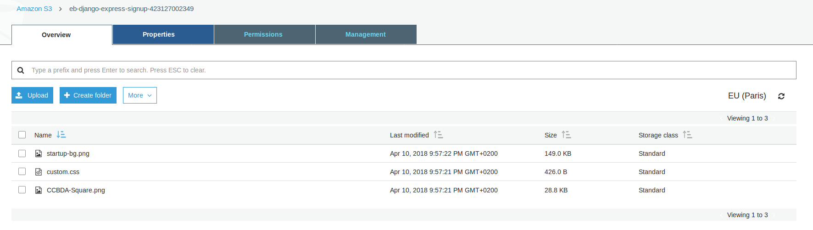
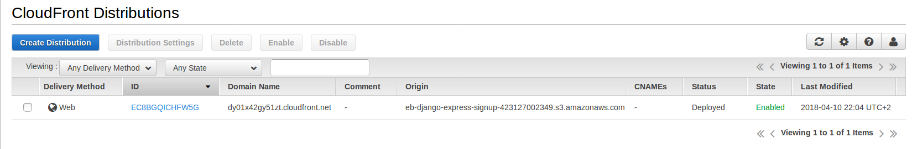
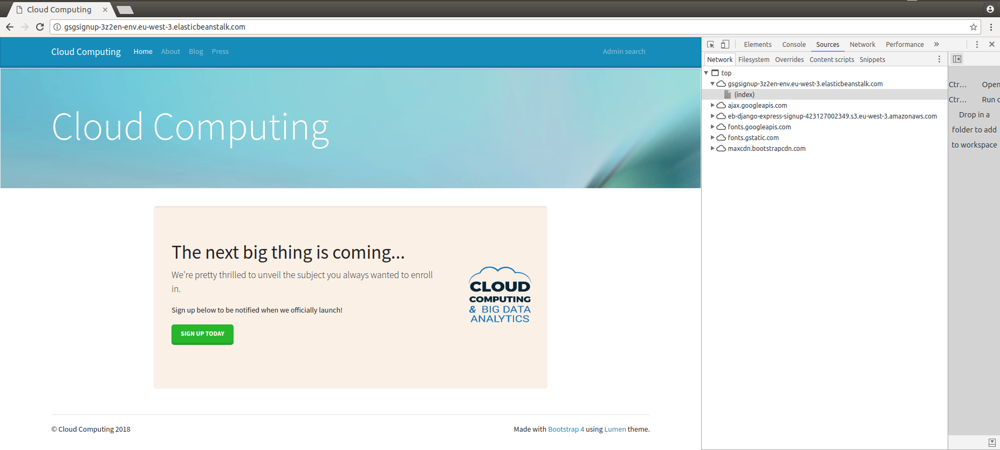

# Lab session #5: Enhancing your web app using additional cloud services

## Task 5.1: Use Amazon Simple Notification Service in your web app

The deployed app works as expected as shown in the following screenshots.

Signing up throught the deployed up:

Record appears on DynamoDB:

SNS arrives at e-mail:

However we faced some challenges during this task:
* While working with PyCharm IDE we had to define the environment variables WITHIN the IDE (configuration problem).
* Initially, we did not commit locally before deploying our app in EB, so technically we were constanlty deploying the same old version of the app without SNS.
* Although we updated the software configuration as indicated in the assignment description, our environment variable SIGNUP_TOPIC was not being recognised. We had to update the eb environment through the bash.

## Task 5.2: Create a new option to retrieve the list of leads

The deployed app includes now an Admin Search feature and a changed navigation menu as shown in the following screenshots.

The Admin Search feature in the deployed app:

The Results page for a specific search:

However, we faced one challenge during this task:
* The current policy attached to the role did not include permission to scan the DynamoDB table. We had to add this permission throught the IAM Management Console (See figure below).

## Task 5.3: Improve the web app transfer of information (optional)

To be more efficient in search page, we created another table in DynamoDb called 'Domain'. Domain table keeps the domain of the email adress, preview selection as composite key. This key creation was selected even though in the application preview has no use in search but since we have the preview filter in the html code we decided for the future use for filtering we need to count based on domain and also preview. To be efficient in aggregation we also keep count_domain attribute in 'Domain' table. This prevents table scan in counting. 

The logic of the new implemented code is; whenever we are adding something to our main table 'gsg-signup-table', domain and preview information is also being added to 'Domain' table. In this 'Domain' table, if the same key exist, the code is incrementing the count of that key, if it is not existed before then it assigns value 1 to the count_domain.

## Task 5.4: Deliver static content using a Content Delivery Network

Our S3 bucket containing the static content looks like this:

Our CloudFront CDN console looks like this:

Finally our deployed app utilizing the CDN looks like this in Google Chrome (note that the static content is delivered through the CDN):

Overall, we spent approximately 6 hours for this lab. The difficulties we experienced are described in each seperate section.
