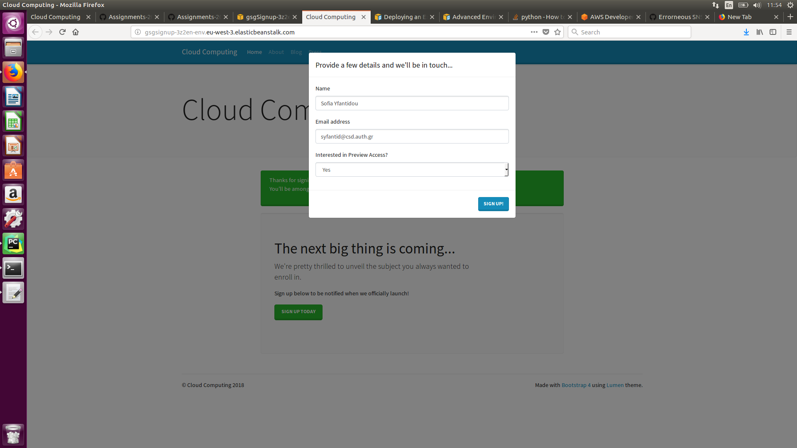
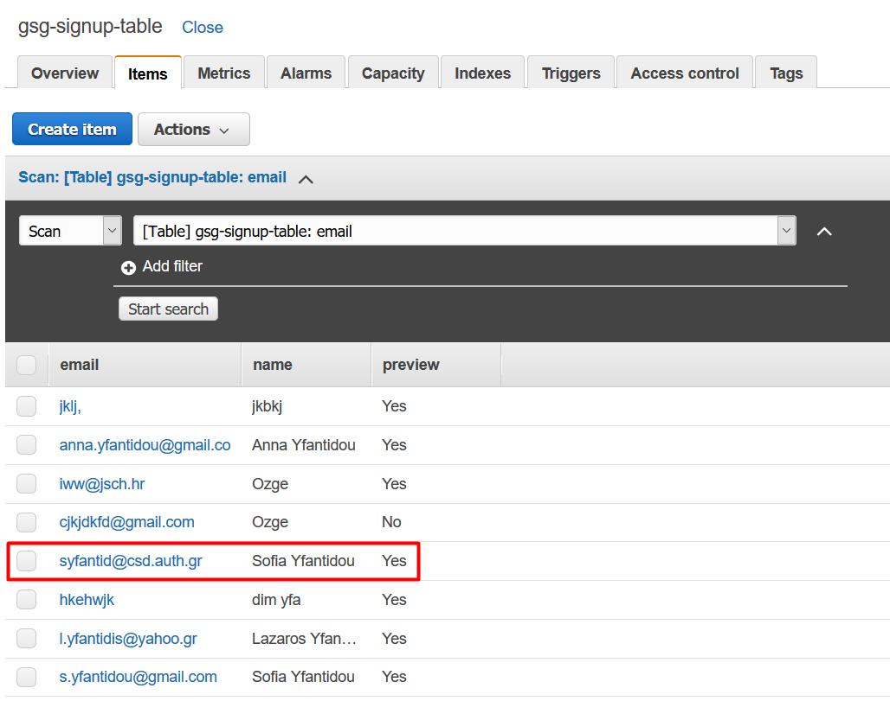
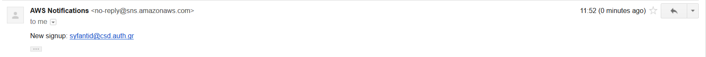

# Lab session #5: Enhancing your web app using additional cloud services

## Task 5.1: Use Amazon Simple Notification Service in your web app

The deployed app works as expected as shown in the following screenshots.

Signing up throught the deployed up:

Record appears on DynamoDB:

SNS arrives at e-mail:

However we faced some challenges during this task:
* While working with PyCharm IDE we had to define the environment variables WITHIN the IDE (configuration problem).
* Initially, we did not commit locally before deploying our app in EB, so technically we were constanlty deploying the same old version of the app without SNS.
* Although we updated the software configuration as indicated in the assignment description, our environment variable SIGNUP_TOPIC was not being recognised. We had to update the eb environment through the bash.

## Task 5.2: Create a new option to retrieve the list of leads

## Task 5.3: Improve the web app transfer of information (optional)

## Task 5.4: Deliver static content using a Content Delivery Network