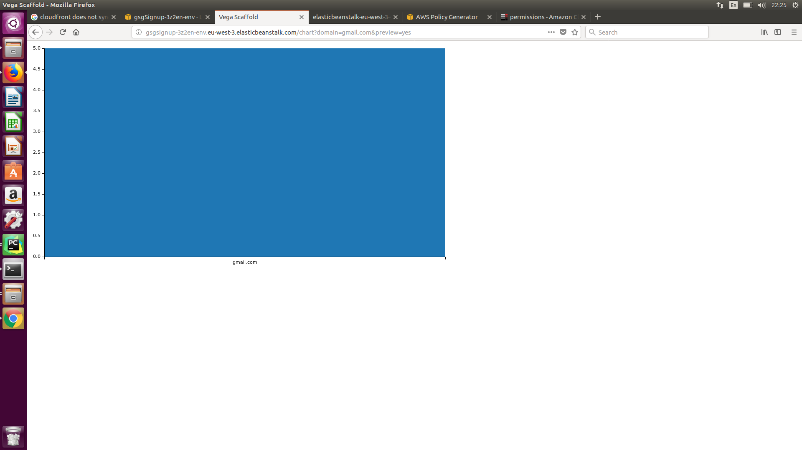
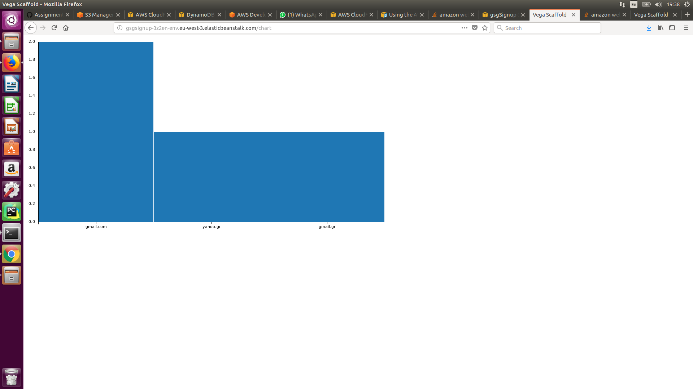
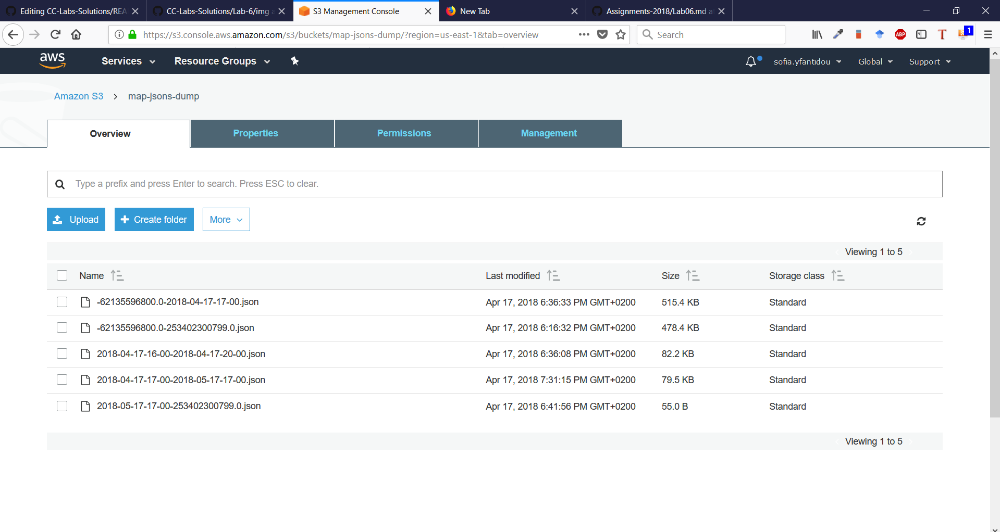
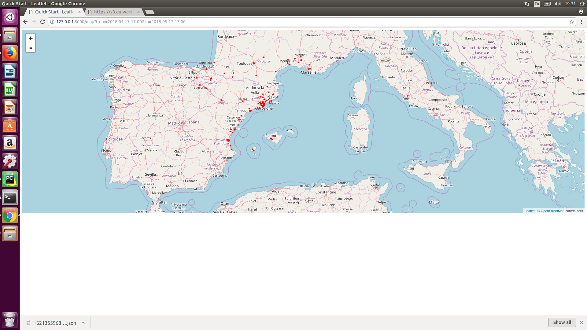
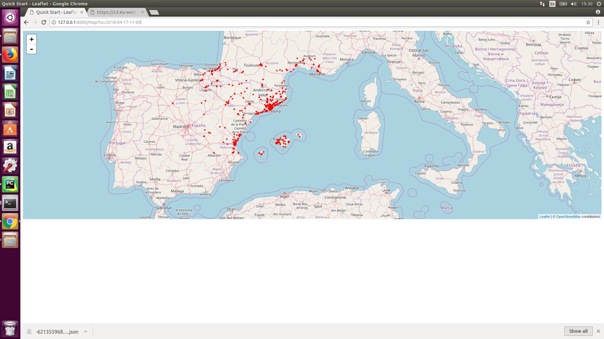
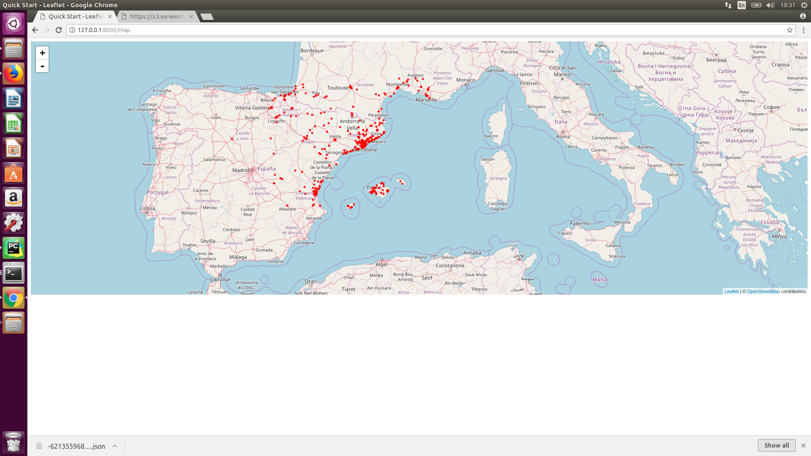
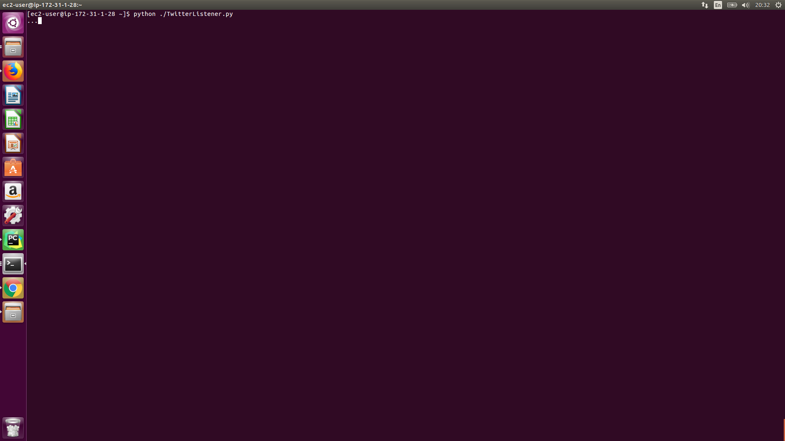

# Lab session #6: Interacting with users and services in the Cloud

## Task 6.1: How to provide your services through a REST API?

### Q61a: Having domain_freq.json written as static content is not the best way to distribute it because different clients can invoke different parameters simultaneously? Can you use S3 to solve the problem? Write the changes in the code and explain your solution?

Yes S3 can be used to solve this problem. The problem is by default, CloudFront doesn't consider headers when caching objects in edge locations. If origin returns two objects and they differ only by the values in the request headers, CloudFront caches only one version of the object. 

To solve this issue, we first uploaded static contents into s3 bucket and created CloudFront distrubution of that bucket. To enable cross-domain access in CLoudFront, we attached CORS configuration to static content bucket because CORS finds a way for client web applications that are loaded in one domain to interact with resources in a different domain. After that  we enabled Header Forwarding in CloudFront distrubution that's associated with the S3 bucket. By doing that we made CloudFront to forward all headers to our origin.

CORS Configuration: 
```xml
<?xml version="1.0" encoding="UTF-8"?>
<CORSConfiguration xmlns="http://s3.amazonaws.com/doc/2006-03-01/">
<CORSRule>
    <AllowedOrigin>http://*</AllowedOrigin>
    <AllowedOrigin>https://*</AllowedOrigin>
    <AllowedMethod>GET</AllowedMethod>
    <MaxAgeSeconds>3000</MaxAgeSeconds>
    <AllowedHeader>*</AllowedHeader>
</CORSRule>
</CORSConfiguration>
```

Moreover, to allow updates on the Domain table (e.g. after a new signup a domain count may need to increment) we needed to adjust our policy to allow UpdateItem action for DynamoDB.

### Q61b: Once you have your solution implemented publish the changes to EB and try the new functionality in the cloud. Did you need to change anything, apart from the code, to make the web app work?

We added software configuration related to CloudFront and S3 bucket to EB. A printscreen of the deployed app can be seen below.

Specifying domain name and preview (Same domain name, different preview parameter):



No parameters:


## Task 6.2: How to provide our service combined with third-party services?

### Q62a: Now we are showing all the collected tweets on the map. Can you think of a way of restricting the tweets plotted using some constraints? For instance, the user could invoke http://127.0.0.1:8000/map?from=2018-02-01-05-20&to=2018-02-03-00-00. Implement that functionality or any other functionality that you think it could be interesting for the users. Change the code to implement the new feature and explain what you have done and show the results in the README.md file for this lab session.

Using a GET request we obtain the requested `from_date` and `to_date` from the URI. Then, in `models.py`, we convert these date strings to a datetime format and to a timestamp string, which is compared to the `created_at` field of each tweet (this field is also stored in a timestamp string format in DynamoDB). Only the tweets that fall within the specified range are returned. If no range is specified then all tweets are returned (full scan). The application supports both bounded and unbounded queries.

### Q62b: Make the necessary changes to have geo_data.json distributed using S3, or the method you used for the above section. Publish your changes to EB and explain what changes have you made to have this new function working.

`geo_data.json` is not a static content file. It changes depending on the user's query. That's why we save multiple files in S3, whose names are representative of the queries they derive from. For instance, for a range between Tue, 17 Apr 2018 19:37:18 GMT (epoch timestamp: 1523993839) and  Wednesday, April 18, 2018 7:37:18 PM (epoch timestamp: 1523993931), the filename would be 1523993839-1523993931.json (See caption below). This way if a user requests the same date range the database will not be queried again, but the result will come from S3. If the query is unbounded then we use the system's minimum and maximum timestamps. This process can be found in `view.py`. Note here that for every user request the application will first look for an equivalent file in S3 and if the file is not found it will query the database return the results and write a new file to S3 for the specific timeframe.



To make this work, we needed to adjust the new buckets CORS configuration again as mentioned above to prevent Cross-Origin Resource Sharing related problems. Also we attached the following Bucket Policy to our S3 Bucket to allow public access to objects, because declaring the bucket as public did not impose public read access to its objects.

```xml
{
    "Version": "2012-10-17",
    "Id": "Policy1523982566712",
    "Statement": [
        {
            "Sid": "Stmt1523982551046",
            "Effect": "Allow",
            "Principal": "*",
            "Action": "s3:GetObject",
            "Resource": "arn:aws:s3:::map-jsons-dump/*"
        }
    ]
}
``` 
The deployed app can be seen in the screenshots below.

Bounded Query:


Unbounded Query:


No parameters:


### Q62c: How would you run TwitterListener.py in the cloud instead of locally? Try to implement your solution and explain what problems have you found and what solutions have you implemented.

Since `TwitterListener.py` is independent of our web application and just uses the same DynamoDB table we should not integrate it in the current application. It should run independently of it. Also, since it is not a Django application but simply a python script with limited dependencies, we do not need to run it through Elastic Beanstalk. 

What we did instead is that we connected through SSH to our EC2 instance and uploaded and executed the `TwitterListener.py` file there. Then it is possible to execute `TwitterListener.py` parallel to the application and stop it at anytime without stopping the application itself. The executed application on the EC2 instance can be seen below.



We also had to install the necesecary requirements (e.g. tweepy, boto, etc.) through `pip install -r requirements.txt`, in order to execute the python script. Given that Amazon's AMI Linux is slighlty different than Ubuntu we had some trouble figuring out how to set up e.g. install pip for Python 3.6 instead of 2.7 (default installation), but finally manage to overcome this difficulty by using the full path to the pip-3.6 executable instead of just the pip command. 
